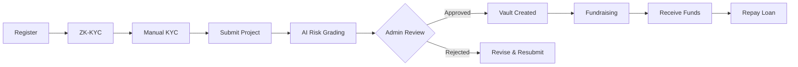
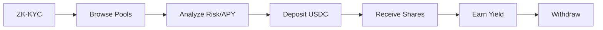

<div align="center">

#  

### **Real Estate On-Chain Construction Financing**

[](https://soliditylang.org/)
[](https://book.getfoundry.sh/)
[](https://react.dev/)
[](LICENSE)

<br/>

**Bypass traditional banking hurdles. Get construction financing based on project viability, market demand, and AI-driven cash flow analysis.**

[Explore Docs](https://foundra.gitbook.io/foundra-docs/) · [View Demo](https://foundra.fly.dev) · [Report Bug](https://github.com/team-mantle-hackathon/issues)

<br/>


</div>

---

## 📋 Table of Contents

- [Overview](#-overview)
- [Key Features](#-key-features)
- [Architecture](#-architecture)
- [Smart Contracts](#-smart-contracts)
- [User Flows](#-user-flows)
- [Pool & Project States](#-pool--project-states)
- [Technology Stack](#-technology-stack)
- [Getting Started](#-getting-started)
- [Development](#-development)
- [Testing](#-testing)
- [Deployment](#-deployment)
- [Security](#-security)
- [License](#-license)

---

## 🎯 Overview

**FOUNDRA** revolutionizes real estate construction financing by leveraging blockchain technology. We provide a decentralized platform where:

- 🏠 **Developers** can access construction financing without traditional banking barriers
- 💰 **Investors** can participate in real estate lending with transparent, tokenized shares
- 🤖 **AI** powers risk assessment for informed decision-making

> _No more stalled projects—just on-chain efficiency._

---

## ✨ Key Features

<table>
<tr>
<td align="center" width="25%">

<br/><b>Construction Financing</b>
<br/><sub>Direct funding for property developers</sub>
</td>
<td align="center" width="25%">

<br/><b>AI Risk Assessment</b>
<br/><sub>Automated grading (A, B, C, D)</sub>
</td>
<td align="center" width="25%">

<br/><b>ZK-KYC Integration</b>
<br/><sub>Privacy-preserving identity verification</sub>
</td>
<td align="center" width="25%">

<br/><b>ERC-4626 Vaults</b>
<br/><sub>Tokenized lending pools</sub>
</td>
</tr>
</table>

---

## 🏛️ Architecture

```
┌─────────────────────────────────────────────────────────────────┐
│                       🔷 PROTOCOL LAYER                         │
├─────────────────────────────────────────────────────────────────┤
│                                                                 │
│   ┌─────────────────┐  ┌──────────────┐  ┌─────────────────┐    │
│   │ProtocolRegistry │  │ VaultFactory │  │   RiskOracle    │    │
│   │   (Registry)    │  │  (Factory)   │  │  (AI Oracle)    │    │
│   └────────┬────────┘  └──────┬───────┘  └────────┬────────┘    │
│            │                  │                   │             │
└────────────┼──────────────────┼───────────────────┼─────────────┘
             │                  │                   │
             ▼                  ▼                   ▼
┌─────────────────────────────────────────────────────────────────┐
│                       🔶 VAULT LAYER                            │
├─────────────────────────────────────────────────────────────────┤
│                                                                 │
│   ┌─────────────┐     ┌─────────────┐     ┌─────────────┐       │
│   │  RWAVault   │     │  RWAVault   │     │  RWAVault   │       │
│   │ (Project 1) │     │ (Project 2) │     │ (Project N) │       │
│   │  ERC-4626   │     │  ERC-4626   │     │  ERC-4626   │       │
│   └─────────────┘     └─────────────┘     └─────────────┘       │
│                                                                 │
└─────────────────────────────────────────────────────────────────┘
```

---

## 📜 Smart Contracts

### Core Contracts

| Contract                   | Description                                           | Key Functions                                           |
| -------------------------- | ----------------------------------------------------- | ------------------------------------------------------- |
| **`ProtocolRegistry.sol`** | Central registry for developers, projects & approvals | `registerDeveloper`, `proposeProject`, `approveProject` |
| **`VaultFactory.sol`**     | Factory for creating lending pool vaults              | `createVault`, `getVaultsByDeveloper`                   |
| **`RWAVault.sol`**         | ERC-4626 vault per project                            | `deposit`, `withdraw`, `makeRepayment`                  |
| **`RiskOracle.sol`**       | AI risk grade integration                             | `requestRiskAssessment`, `fulfillRiskAssessment`        |

### Interfaces

```
src/interfaces/
├── IProtocolRegistry.sol
├── IRWAVault.sol
├── IRiskOracle.sol
└── IVaultFactory.sol
```

---

## 👥 User Flows

### 🏢 Developer Flow



<details>
<summary><b>📖 Detailed Steps</b></summary>

1. **Register** - Submit company information
2. **ZK-KYC** - Complete identity verification via Binance/Reclaim
3. **Manual KYC** - Detailed identity verification
4. **Submit Project** - Location, budget, timeline + documents
5. **AI Grading** - Automated risk assessment
6. **Admin Approval** - Final review by protocol admins
7. **Vault Created** - ERC-4626 pool initialized
8. **Fundraising** - Investors can deposit
9. **Receive Funds** - When target is reached
10. **Repay** - Flexible repayment before due date

</details>

---

### 💰 Investor Flow



<details>
<summary><b>📖 Detailed Steps</b></summary>

1. **ZK-KYC** - Complete identity verification
2. **Browse Pools** - Filter by risk grade, APY, tenor
3. **Deposit USDC** - Minimum 100,000 IDR equivalent
4. **Receive Shares** - ERC-4626 vault tokens
5. **Earn Yield** - Proportional to holdings
6. **Withdraw** - After maturity, completion, or cancellation

</details>

---

## 📊 Pool & Project States

### Pool States

```
┌──────────┐    ┌─────────────┐    ┌────────┐    ┌──────────┐    ┌───────────┐
│ Pending  │───▶│ Fundraising │───▶│ Active │───▶│ Repaying │───▶│ Completed │
└──────────┘    └─────────────┘    └────────┘    └──────────┘    └───────────┘
     │                │
     │                │
     ▼                ▼
┌───────────┐   ┌───────────┐                    ┌───────────┐
│ Cancelled │   │ Cancelled │                    │ Defaulted │
└───────────┘   └───────────┘                    └───────────┘
```

| State              | Description                     |
| ------------------ | ------------------------------- |
| 🟡 **Pending**     | Awaiting admin approval         |
| 🟢 **Fundraising** | Open for investments            |
| 🔵 **Active**      | Target reached, funds disbursed |
| 🟣 **Repaying**    | Developer making repayments     |
| ✅ **Completed**   | Fully repaid                    |
| 🔴 **Defaulted**   | Payment overdue                 |
| ⚪ **Cancelled**   | Refunded to investors           |

---

### Key Pool Parameters

| Parameter              | Description                 |
| ---------------------- | --------------------------- |
| 💵 **Target Raise**    | Funding goal amount         |
| 📈 **Target APY**      | Expected annual yield       |
| ⏱️ **Tenor**           | Investment duration         |
| 💰 **Min Investment**  | Minimum deposit amount      |
| 🎯 **AI Risk Grade**   | A, B, C, or D rating        |
| 📋 **Project Details** | Developer info & collateral |

---

## 🛠️ Technology Stack

<table>
<tr>
<th>Category</th>
<th>Technology</th>
</tr>
<tr>
<td><b>Smart Contracts</b></td>
<td>


</td>
</tr>
<tr>
<td><b>Frontend</b></td>
<td>


</td>
</tr>
<tr>
<td><b>Web3</b></td>
<td>


</td>
</tr>
<tr>
<td><b>Backend</b></td>
<td>

</td>
</tr>
<tr>
<td><b>KYC</b></td>
<td>

</td>
</tr>
</table>

---

## 🚀 Getting Started

### Prerequisites

- [Node.js](https://nodejs.org/) >= 22
- [Foundry](https://book.getfoundry.sh/getting-started/installation)
- [Git](https://git-scm.com/)

### Installation

```bash
# Clone the repository
git clone https://github.com/team-mantle-hackathon/foundra.git
cd foundra

# Install smart contract dependencies
cd smart-contract
forge install

# Install frontend dependencies
cd ../front-end
npm install
```

---

## 💻 Development

### Smart Contracts

```bash
cd smart-contract

# Compile contracts
forge build

# Run local node
anvil

# Deploy mock USDC first
# (use an anvil private key in PRIVATE_KEY)
export PRIVATE_KEY=0xYOUR_ANVIL_PRIVATE_KEY
forge script script/DeployMockUSDC.s.sol --rpc-url http://localhost:8545 --broadcast

# Set required env vars for core deployment
export MOCK_USDC_ADDRESS=0xYOUR_MOCK_USDC_ADDRESS
export WITNESS_ADDRESS=0xYOUR_WITNESS_ADDRESS

# Mint mock USDC to yourself (example: 1,000 USDC)
cast send $MOCK_USDC_ADDRESS \
  "mintWhole(address,uint256)" 0xYOUR_ADDRESS 1000 \
  --private-key $PRIVATE_KEY \
  --rpc-url http://localhost:8545

# Deploy core contracts locally
forge script script/Deploy.s.sol --rpc-url http://localhost:8545 --broadcast
```

### Frontend

```bash
cd front-end

# Start development server
npm run dev

# Build for production
npm run build

# Run linting
npm run lint
```

---

## 🧪 Testing

```bash
cd smart-contract

# Run all tests
forge test -vvv

# Run specific test
forge test --match-test testDeposit -vvv

# Generate gas report
forge test --gas-report

# Run with coverage
forge coverage
```

---

## 🌐 Deployment

### Testnet (Mantle Sepolia)

```bash
cd smart-contract

# Set environment variables
cp .env.example .env
# Edit .env with your private key and RPC URL

# Deploy mock USDC first (save the address)
forge script script/DeployMockUSDC.s.sol \
  --rpc-url mantle_sepolia \
  --verify \
  --broadcast \
  -vvvv

# Set required env vars for core deployment
export MOCK_USDC_ADDRESS=0xYOUR_MOCK_USDC_ADDRESS
export WITNESS_ADDRESS=0xYOUR_WITNESS_ADDRESS

# Mint mock USDC to yourself (example: 1,000 USDC)
cast send $MOCK_USDC_ADDRESS \
  "mintWhole(address,uint256)" YOUR_ADDRESS 1000 \
  --private-key $PRIVATE_KEY \
  --rpc-url $RPC_URL

# Deploy to Mantle Sepolia
forge script script/Deploy.s.sol:Deploy \
  --rpc-url mantle_sepolia \
  --verify \
  --broadcast \
  -vvvv
```

### Environment Variables

```env
PRIVATE_KEY=your_private_key
RPC_URL=https://rpc.sepolia.mantle.xyz
ETHERSCAN_API_KEY=your_api_key
```

---

## 🔒 Security

### Features

| Feature                 | Description                                       |
| ----------------------- | ------------------------------------------------- |
| 🔐 **Access Control**   | Role-based permissions (Admin, Developer, Oracle) |
| ⏸️ **Pausable**         | Emergency pause functionality                     |
| 🔄 **Reentrancy Guard** | Protection against reentrancy attacks             |
| ⚡ **Rate Limiting**    | Prevents abuse                                    |
| 🔑 **Multi-sig**        | Admin controls (Future Implementation)            |

### Audit Status

> ⚠️ **Note**: This project has not yet been audited. Use at your own risk.

---

## 📁 Project Structure

```
foundra/
├── 📂 smart-contract/
│   ├── 📂 src/
│   │   ├── 📂 core/           # Core protocol contracts
│   │   ├── 📂 interfaces/     # Contract interfaces
│   │   ├── 📂 vault/          # ERC-4626 vault
│   │   └── 📂 mockUSDC/       # Test token
│   ├── 📂 script/             # Deployment scripts
│   ├── 📂 test/               # Contract tests
│   └── 📄 foundry.toml        # Foundry config
│
├── 📂 front-end/
│   ├── 📂 src/
│   │   ├── 📂 app/            # Page components
│   │   ├── 📂 components/     # UI components
│   │   ├── 📂 constants/      # ABIs & addresses
│   │   ├── 📂 hooks/          # React hooks
│   │   └── 📂 lib/            # Utilities
│   └── 📄 package.json
│
└── 📂 edge-functions-supabase/
    ├── 📄 ai-risk-assessment.ts
    └── 📄 verify-proof-zk.ts
```

---

## 🤝 Contributing

Contributions are welcome! Please feel free to submit a Pull Request.

1. Fork the project
2. Create your feature branch (`git checkout -b feature/AmazingFeature`)
3. Commit your changes (`git commit -m 'Add some AmazingFeature'`)
4. Push to the branch (`git push origin feature/AmazingFeature`)
5. Open a Pull Request

---

## 📄 License

This project is licensed under the MIT License - see the [LICENSE](LICENSE) file for details.

---

<div align="center">

**Built with ❤️ for the future of real estate financing**

<br/>

[](https://github.com/team-mantle-hackathon/foundra)
[](https://twitter.com/foundra)

</div>
